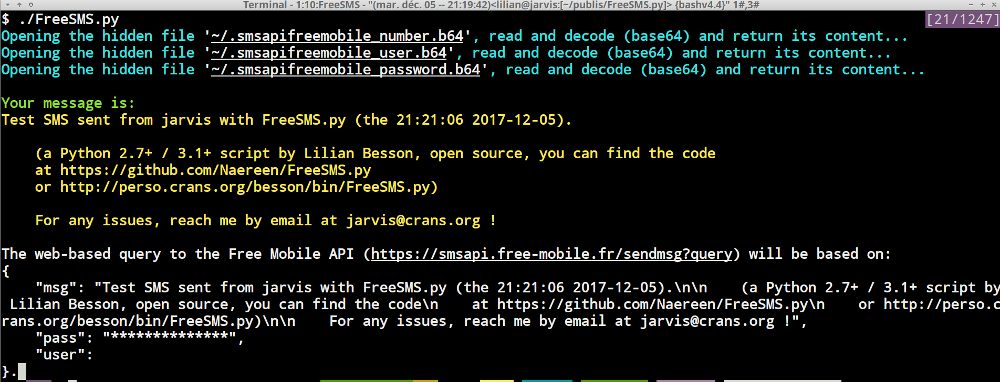

# :fr: :phone: FreeSMS.py

Un petit script Python 2 ou 3 pour s'envoyer des textos (messages SMS) en ligne de commande, via l'[API de Free](https://mobile.free.fr/moncompte/index.php?page=options&show=20) (uniquement pour un téléphone avec une carte SIM Free).

## Exemples
### Usage simple
1. [Installer ce script](#Installation),
2. Configurer l'API SMS de Free, via [votre espace client](https://mobile.free.fr/moncompte/index.php?page=options&show=20), et noter votre identifiant et clé d'accès à l'API,
3. Lancer une première fois le script `FreeSMS.py` pour savoir comment stocker ces deux codes,
4. Tester avec un exemple :
    ```bash
    FreeSMS.py "Lis cet article très intéressant plus tard : http://tryalgo.org/fr/2017/08/08/bellman/"
    ```
5. Soyez tout content :+1: ! Et ajouter une [petite étoile](https://github.com/Naereen/FreeSMS.py/stargazers) :star: à ce projet !

Cela va vous envoyer un texto contenant ce texte, si tout est bien configuré.


### Aide
L'usage du script est le suivant :

```bash
FreeSMS.py --help|-h | -f file | body of the message
```

- Sans argument, envoie un message de test,
  

- Avec `-h` ou `--help`, affiche l'aide,
- Avec `-f FILE`, envoie le contenu de ce fichier (en plusieurs morceaux si besoin).

### Aide détaillée
```bash
$ ./FreeSMS.py --help
Opening the hidden file '~/.smsapifreemobile_number.b64', read and decode (base64) and return its content...

FreeSMS.py --help|-h | -f file | body of the message

A simple Python script to send a text message to a Free Mobile phone.
The message should be smaller than 480 caracters.

Examples:
$ FreeSMS.py --help
Print this help message!

$ FreeSMS.py -f MyMessageFile.txt
Try to send the content of the file MyMessageFile.txt.

$ FreeSMS.py "I like using Python to send me SMS from my laptop -- and it's free thanks to Free !"
Will send a test message to your mobile phone.

Copyleft 2014-17 Lilian Besson (License MIT)
THE SOFTWARE IS PROVIDED "AS IS", WITHOUT WARRANTY OF ANY KIND.
```

### Usage automatisé ?
Mon script [mymake.sh](https://bitbucket.org/lbesson/bin/src/master/mymake.sh) enrobe l'outil [GNU make](https://www.gnu.org/software/make/) pour m'envoyer un texto quand une simulation est terminée (avec un texte différent selon un échec ou une réussite).

  

#### Suggestions
- J'utilise des Makefile pour lancer mes simulations numériques sur un serveur de calcul, afin de me prévenir en cas d'erreur ou quand les calculs sont finis,
- Par exemple, [pour ces simulations](http://banditslilian.gforge.inria.fr/How_to_run_the_code.html#Using-env-variables-?),
- Et avec un fichier `.use_FreeSMS_for_mymake` créé dans le HOME, l'option `--FreeSMS` est activé par défaut.


### Cas d'échec
Le script est traduit en français et anglais, et il affiche des messages d'erreurs clairs selon les causes d'échec.

----

## Installation
### Manuellement ?

Facile !
Cloner ce dépôt, aller dans le dossier, et déplacer le script [`FreeSMS.py`](FreeSMS.py) dans un autre dossier accessible dans votre `$PATH`.

Au premier lancement du script, il vous expliquera comment créer les fichiers privés nécessaires à l'utilisation de `FreeSMS.py`, et les stocke dans votre HOME (`~`) :

- [`~/.smsapifreemobile_user.b64`](.smsapifreemobile_user.b64) : contient votre identifiant de compte Free,
- [`~/.smsapifreemobile_password.b64`](.smsapifreemobile_password.b64) : contient votre mot de passe,
- [`~/.smsapifreemobile_number.b64`](.smsapifreemobile_number.b64) : contient votre numéro de téléphone, encodé en base 64.

Les trois fichiers fournis en exemple ne sont, bien-sûr, pas valides, mais montre la forme qu'ils doivent avoir.

En résumé, exécuter ça :

```bash
cd /tmp/
git clone https://GitHub.com/Naereen/FreeSMS.py
cd FreeSMS.py/
cp FreeSMS.py /un/dossier/dans/votre/PATH  # exemple ~/.local/bin/
FreeSMS.py   # va vous aider à créer ~/.smsapifreemobile_number.b64  ~/.smsapifreemobile_password.b64  ~/.smsapifreemobile_user.b64
```

> Si quelque chose ne fonctionne pas bien, merci [de signaler un problème](https://github.com/Naereen/FreeSMS.py/issues/new) :clap: !

### Avec `pip` ?
Ce projet ne sera pas distribué sur [le dépôt de packet Pypi](https://pypi.org/), mais il peut être installé directement depuis GitHub avec [`pip`](http://pip.pypa.io/) et cette commande :

```bash
sudo pip install git+https://github.com/Naereen/FreeSMS.py
```

Vérifiez que vous utilisez `pip2` ou `pip3` selon la version de Python pour laquelle vous voulez installer cet outil.  ([Python 3 est évidemment recommandé](https://pythonclock.org/))


----

## À propos :notebook:
### Langage et version(s) ?
Python v2.7+ ou Python v3.1+ (version CPython).

### :scroll: Licence ? [](https://github.com/Naereen/badges/blob/master/LICENSE)
Ce script et cette documentation sont distribuées en accès libre selon les conditions de la [licence MIT](https://lbesson.mit-license.org/) (cf le fichier [LICENSE](LICENSE) en anglais).
© [Lilian Besson](https://GitHub.com/Naereen), 2017-2018.

> Merci à [Thibault Groueix](https://github.com/ThibaultGROUEIX) pour des tests et des commentaires utiles en juillet 2016 et novembre 2017.

[](https://GitHub.com/Naereen/FreeSMS.py/graphs/commit-activity)
[](https://GitHub.com/Naereen/ama.fr)
[](https://GitHub.com/Naereen/FreeSMS.py/)

[](http://ForTheBadge.com)
[](https://GitHub.com/)

[](https://www.python.org/)
[](https://GitHub.com/Naereen/)
