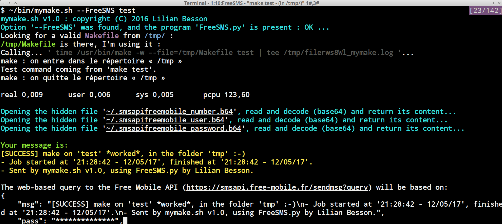

# :fr: :phone: FreeSMS.py

Un petit script Python 2 ou 3 pour s'envoyer des textos (messages SMS) via l'API de Free (uniquement pour cartes SIM Free)

## Exemples
### Usage simple
```bash
FreeSMS.py "Lis cet article très intéressant plus tard : http://tryalgo.org/fr/2017/08/08/bellman/"
```

Cela va m'envoyer un texto contenant ce texte.


### Usage automatisé
Mon script `mymake.sh <https://bitbucket.org/lbesson/bin/src/master/mymake.sh>`_ enrobe l'outil `GNU make <https://www.gnu.org/software/make/>`_ pour m'envoyer un texto quand une simulation est terminée (avec un texte différent selon un échec ou une réussite).


### Cas d'échec
Le script est traduit en français et anglais, et il affiche des messages d'erreurs clairs selon les causes d'échec :




----

## Installation
### Manuellement ?

Facile !
Cloner ce dépôt, aller dans le dossier, et déplacer le script [`FreeSMS.py`](FreeSMS.py) dans un autre dossier accessible dans votre `$PATH`.

Au premier lancement du script, il vous expliquera comment créer les fichiers privés :

- `.smsapifreemobile_user.b64` : contient votre identifiant de compte Free,
- `.smsapifreemobile_password.b64` : contient votre mot de passe,
- `.smsapifreemobile_number.b64` : contient votre numéro de téléphone, encodé en base 64.


```bash
cd /tmp/
git clone https://GitHub.com/Naereen/FreeSMS.py
cd FreeSMS.py/
cp FreeSMS.py /un/dossier/dans/votre/PATH  # exemple ~/.local/bin/
FreeSMS.py   # va vous aider à créer ~/.smsapifreemobile_number.b64  ~/.smsapifreemobile_password.b64  ~/.smsapifreemobile_user.b64
```

### With pip ?
This project is not yet hosted on [the Pypi package repository](https://pypi.org/), but it can be installed directly from GitHub with [`pip`](http://pip.pypa.io/):

```bash
sudo pip install git+https://github.com/Naereen/FreeSMS.py
```

Check that you use pip2 or pip3 whether you want it installed for Python 2 or Python 3. ([Python 3 is obviously recommended](https://pythonclock.org/))


----

## About
### Language?
Python v2.7+ or Python v3.1+.

### :scroll: License ? [](https://github.com/Naereen/badges/blob/master/LICENSE)
[MIT Licensed](https://lbesson.mit-license.org/) (file [LICENSE](LICENSE)).
© [Lilian Besson](https://GitHub.com/Naereen), 2017.

[](https://GitHub.com/Naereen/FreeSMS.py/graphs/commit-activity)
[](https://GitHub.com/Naereen/ama)
[](https://GitHub.com/Naereen/FreeSMS.py/)

[](http://ForTheBadge.com)
[](https://GitHub.com/)

[](https://www.python.org/)
[](https://GitHub.com/Naereen/)
